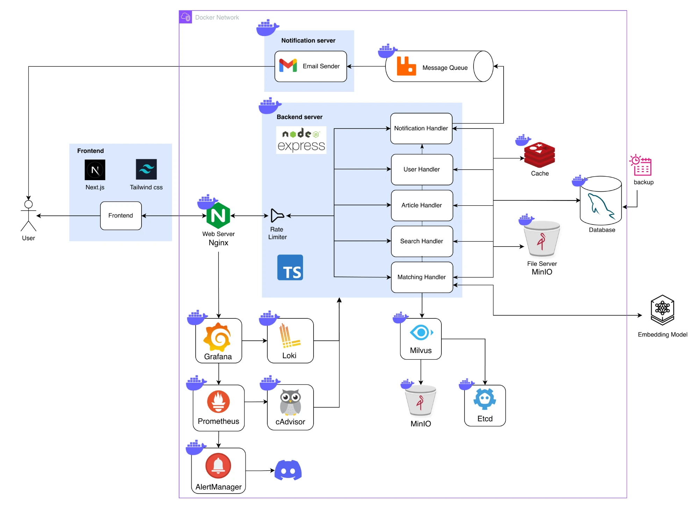
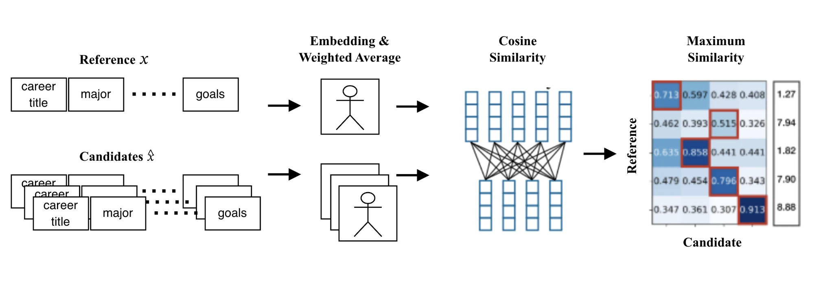

# DengTa (燈塔) — Backend

[](https://github.com/DengtaTech/Dengta-Backend/actions/workflows/test.yml)
[](https://github.com/DengtaTech/Dengta-Backend/actions/workflows/prTest.yml)
[](https://github.com/DengtaTech/Dengta-Backend/actions/workflows/sonarqube.yml)
[](https://github.com/DengtaTech/Dengta-Backend/actions/workflows/deploy.yml)

> An app for people searching for their career direction.
> There are no shortcuts to a dream, but there are definitely more efficient paths!

DengTa lets users write their growth journey into a **Career Storybook**, then uses semantic vector matching to find **role models who are a few steps ahead of you and share your goals**. This repo is the backend service (Node.js + Express + TypeScript).

## Table of Contents

- [Specification](#specification)
- [Main Functions](#main-functions)
  - [1. Career Storybook (Footprint)](#1-career-storybook-footprint)
  - [2. Role Model Matching (Recommendation)](#2-role-model-matching-recommendation)
  - [3. Other Features](#3-other-features)
- [System Design](#system-design)
- [How to Run](#how-to-run)

---

## Specification



| Category                 | Technology                                                                                                                                         |
| ------------------------ | -------------------------------------------------------------------------------------------------------------------------------------------------- |
| Runtime / Framework      | Node.js 20, Express 4, TypeScript (ESM)                                                                                                            |
| ORM / Relational DB      | TypeORM + MySQL 8                                                                                                                                  |
| Cache / Rate limiting    | Redis (ioredis) + Lua script                                                                                                                       |
| Vector DB                | Milvus 2.4 (depends on etcd + MinIO); index `IVF_FLAT`, metric `COSINE`, 768 dimensions                                                            |
| Embedding model          | [`DMetaSoul/Dmeta-embedding-zh`](https://huggingface.co/DMetaSoul/Dmeta-embedding-zh) (Python FastAPI + sentence-transformers, standalone service) |
| File storage             | MinIO (avatars, footprint images)                                                                                                                  |
| Authentication           | JWT (24h expiry), bcrypt password hashing                                                                                                          |
| Chinese tokenization     | nodejieba (trending keyword statistics)                                                                                                            |
| Email                    | nodemailer + MJML templates (`emails/`)                                                                                                            |
| Logging                  | pino                                                                                                                                               |
| Testing                  | Jest + supertest, k6 (load test), SonarQube                                                                                                        |
| Deployment               | Docker / Docker Compose, Nginx, GitHub Actions (self-hosted runner), Infisical (secret management)                                                 |
| Frontend (separate repo) | Next.js + Tailwind CSS                                                                                                                             |

**Project structure (layered)**

```
src/
├── Routers/            # Route definitions, middleware wiring (JWT, multer)
├── Controller/         # Request parsing and basic validation
├── Application/Features/<Domain>/<UseCase>/   # One handler per use case + response builder + API types
├── Infrastructure/
│   ├── Service/        # Business logic (embedding, recommendation, notification, email)
│   └── Repository/     # Data access (MySQL / Milvus)
├── Database/           # TypeORM entities, Redis cache, Milvus, MinIO, logger
├── Middlewares/        # auth, rateLimiter, multer, errorHandler
├── EmbeddingsServer/   # Embedding model service (Python)
└── Test/               # API / unit tests, mock data, Postman collections
```

---

## Main Functions

All APIs are prefixed with `/api/1.0` (images are served under `/image`). Endpoints marked 🔒 require `Authorization: Bearer <JWT>`.

### 1. Career Storybook (Footprint)

Users record important moments of their lives as **Footprints** (title, content, occurrence time, hashtags, cover image and inline images), which together form their **Career Storybook**. Footprints have adjustable settings (`PATCH /footprint/setting`), and users can also publish **Quick Posts**. Other users can react to a footprint with emotions or leave a **Bowl** (feedback comment) for the author.

**Features (43 APIs in total)**

- Footprint: init draft → upload images → publish; update settings, delete, view detail
- Quick Post: create / update / delete
- Reaction: react to a footprint with an emotion; the author gets notified
- Bowl: leave advice / feedback on someone's story; others can "push" it (like, revocable); the author can "accept" it
- Card: a shareable public profile card link; public footprints are viewable without login
- Follow / unfollow, search followees, search users (with search history)
- In-app notifications, official announcements, weekly trending keywords

- _Search — `/search` (3)_: `POST` search users (by name / hashtag, recorded in history), `GET` search history, `DELETE` clear history.
- _Notification — `/notification` (4)_: `GET` list notifications, `PATCH /read` mark as read, `POST /official` send an official announcement (admin only), `POST /keyword` trigger the weekly trending-keyword email.
- _Question — `/question` (3)_: `GET /` get questionnaire items, `POST /response` submit answers, `GET /check` check whether the user has filled it in.
- _Volume — `/volume` (1)_: `GET /mention` this week's trending keyword statistics.
- _Image — `/image`_: `GET /:bucketName/*` stream an image from MinIO.

> Full request / response examples: see `swagger.yaml` and `src/Test/api_postman/`.

### 2. Role Model Matching (Recommendation)

The user enters their **goal** (who they want to become / which field they want to enter). The system searches every user's career story for people who are **most similar to your current self plus your goal, and who have already walked that path**, and returns the **life interval** that matches (e.g. "between ages 22 and 25 they went through these things"), so you can see a reference path.

See [System Design → Role Model Matching](#role-model-matching) for how it works.

### 3. Other Features

- **Questionnaire (Question Items)**: after sign-up, users are guided to answer growth-goal questions (career direction, a more specific field, what triggered the goal, personal growth goals). Answers are converted to embeddings and used in matching.
- **Trending keywords (Mention)**: content is tokenized with jieba, keywords are counted weekly, and a weekly digest email can be sent.
- **Notifications**: events such as being followed, a footprint receiving a reaction, and official announcements are written as in-app notifications (`notification` table).

---

## System Design

The whole system runs inside a single Docker network with Nginx as the only entry point. Design considerations per component are listed below.

The backend is split into handlers (User / Article (Footprint) / Search / Matching / Notification). Dependencies flow one way: Router → Controller → Handler → Service → Repository.

### Notification system (Message Queue + Notification Server)

- **Problem**: sending email is slow, failure-prone external I/O (SMTP / Gmail). Doing it synchronously inside the main service raises API latency, and an email outage would drag down the main flow.
- **Design**: the backend only publishes an "send email" task to a **Message Queue (RabbitMQ)** and responds immediately. A separate **Notification server (Email Sender)** consumes from the queue and sends the email.
- **Benefits**:
  - **Time decoupling**: the backend does not wait for the email to be sent, which **reduces API latency**.
  - **Space decoupling**: the two services are deployed and scaled independently, with the queue as a buffer. Either side can be scaled, restarted or fail without affecting the other, which **improves availability and scalability**.
  - The queue absorbs bursts (e.g. official announcements, weekly keyword mass mailing) so SMTP is not overwhelmed.
- **Notification types**: in-app notifications (stored in MySQL `notification`, with read state and pagination) and email notifications (MJML templates under `emails/`: `get-followed`, `hit-bowl`, `new-footprint`, `official-notification`, `weekly-keyword-notification`).

### Rate Limiter (Sliding Window Counter + Lua)

Implemented in [`src/Middlewares/rateLimiter.ts`](src/Middlewares/rateLimiter.ts) and [`src/utils/rateLimit.lua`](src/utils/rateLimit.lua). It is mounted before all routes and keyed by `req.ip`.

- **Why Sliding Window Counter**: a Fixed Window lets through up to 2× the limit across a window boundary; a Sliding Log is precise but stores a timestamp per request, which is memory-hungry. The Sliding Window Counter keeps only two counters (current and previous window) and weights the previous window by how much of the current window has elapsed, giving good accuracy with O(1) time and space:

  ```
  total = previousCount × (1 − elapsedRatio) + currentCount + 1
  ```

- **Why Lua**: "read two counters → compute → decide → INCR + EXPIRE" must be **atomic**, otherwise concurrent requests cause race conditions. Putting the whole logic in a Redis Lua script makes it a single round trip that executes atomically. The script is preloaded with `SCRIPT LOAD` at startup and invoked with `EVALSHA`, avoiding resending the script on every request.
- **Parameters**: 1-second window, 20 requests per IP (`RATE_LIMIT_WINDOW_SIZE` / `RATE_LIMIT_MAX_REQUESTS`); exceeding it returns `429`.
- **Fail-open**: if Redis or the script fails, requests are allowed through so the limiter itself is not a single point of failure.
- Counter keys are set with `EXPIRE = 2 × window` so keys do not grow without bound.

### Cache (Cache-Aside + Redis)

Implemented in [`src/Database/Cache/`](src/Database/Cache) and `userService.getUserInfo`.

- **Read**: check Redis first → return on hit; on miss, query MySQL (user + links + hashtags + card) and write the result back to Redis.
- **Write**: when a profile is updated, the corresponding cache entry is deleted (invalidated) and rebuilt on the next read, avoiding stale data.
- **TTL**: 24 hours by default, so bad data cannot linger indefinitely.
- User profile is hot data read on almost every page; Cache-Aside greatly reduces MySQL queries and **improves performance**.
- Redis access is wrapped by a `BaseEntity` abstraction (`user:<id>:<field>` key convention + JSON serialization); adding a new cached entity only requires subclassing it.

### File service (MinIO)

Avatars, footprint cover images and inline images are uploaded (multer) into MinIO buckets and served through `/image/:bucketName/*` as a stream with the correct `Content-Type`. The database stores only the object path.

### Role Model Matching



**Matching inputs**: profile (lifeRole, selfIntro, profile hashtags), questionnaire answers, future goal, and career-story articles (footprint title, content, hashtags).

**Pipeline**

1. **Embedding**: text is sent to the standalone Embedding Server (`Dmeta-embedding-zh`, 768 dimensions) to get vectors. Each vector is **persisted in MySQL** (`user_embedding`, `footprint_embedding`, `*_hashtag_embedding`, `m_user_question_item_embedding`) to avoid recomputation and to make querying and recomputing easy.
2. **Weighted total vector**: each source vector is multiplied by its weight (`EMBEDDING_WEIGHTS` in `src/Config/constants.ts`: lifeRole / selfIntro / profileTags / goal / footprint title, tags, content / questionnaire), summed, and normalized into one vector representing the person.
3. **Life intervals**: for each user, a **sliding window** (`FOOTPRINT_INTERVAL_SIZE = 4`, i.e. every 4 consecutive footprints) produces one interval vector, stored in the Milvus collection `user_intervals_embedding` (fields: `userId`, `startFootprintId`, `endFootprintId`, `embedding`). This finds people who are similar to you during **a specific period of life**, rather than only comparing whole profiles. Publishing a footprint adds the new interval incrementally; updating profile or questionnaire data recomputes all of that user's intervals.
4. **Query**: take the user's latest interval vector (if none, compute it from profile data; if the user has no footprints, use only profile and questionnaire data), **blend it with the goal embedding using the goal weight**, then search Milvus by **COSINE similarity**, excluding the user, grouping by `userId` (one best interval per person), and return the top 8.
5. **Result assembly**: attach profile and follower count, and compute start / end ages from the footprint `occurAt` and the user's birthday, so users can see "what they did between which ages".

**Why Milvus + MySQL**

- Vector similarity search is a heavy high-dimensional computation; a full table scan in MySQL is impractical. Introducing **Milvus (ANN index IVF_FLAT)** greatly **improves vector computation performance**.
- **MySQL keeps the raw vectors** as the source of truth: easy to query, and the Milvus interval vectors can be rebuilt when weights or the model change.

### Observability (Monitoring)

- **Grafana** is the unified dashboard, with **Loki** (logs) and **Prometheus** (metrics) as data sources.
- **cAdvisor** collects per-container CPU / memory metrics, scraped by Prometheus.
- **AlertManager** fires alerts by rule and pushes them to **Discord**.
- At the application level, pino emits structured logs (toggled by `LOGGING_ENABLED`).

### CI/CD

Pipelines are defined in [`.github/workflows/`](.github/workflows), run on a self-hosted runner (`dengta-ubuntu`), and report results through a Discord webhook.

| Workflow           | Trigger                        | What it does                                                                                                                                                                                    |
| ------------------ | ------------------------------ | ----------------------------------------------------------------------------------------------------------------------------------------------------------------------------------------------- |
| `prTest.yml`       | PR to `main` / `develop`       | Verifies the Docker image builds                                                                                                                                                                |
| `test.yml` (CI)    | PR / called by CD              | Starts MySQL / Redis / Milvus with `docker-compose-ci.yml`, waits until they are ready, then runs `npm run test:ci`                                                                             |
| `sonarqube.yml`    | push / PR                      | SonarQube scan + Quality Gate                                                                                                                                                                   |
| `bump-version.yml` | Manual (major / minor / patch) | Updates `.version`, commits, and pushes a `v*` tag                                                                                                                                              |
| `deploy.yml` (CD)  | push of a `v*` tag             | Runs tests first → on success deploys: copy code to `/srv`, inject env, `docker compose build --no-cache && up -d`, `nginx -s reload` → creates a GitHub Release (auto-generated release notes) |

Also: a **Husky** pre-commit hook runs Prettier; **Infisical** injects secrets at runtime (no secrets baked into the image); the Dockerfile runs as a non-root user and prunes devDependencies after `tsc`.

---

## How to Run

### Prerequisites

- Node.js 20+, npm
- Docker and Docker Compose
- (Optional) [Infisical CLI](https://infisical.com/docs/cli/overview): used by `npm run devi` and `npm test` to inject environment variables

### 1. Install dependencies

```bash
npm install --legacy-peer-deps
```

### 2. Prepare environment variables

Copy the template and fill in the values (`.env.*` is gitignored — never commit it):

```bash
cp .env_dev_example .env.dev
```

At minimum you need: MySQL (`MYSQL_*`), Redis (`REDIS_*`), Milvus (`MILVUS_*`), Embedding Server (`EMBEDDING_SERVER_PORT`, `EMBEDDING_SERVER_URL`), `JWT_SECRET`, MinIO (`MINIO_ENDPOINT` / `MINIO_ACCESS_KEY` / `MINIO_SECRET_KEY` / `MINIO_AVATAR_BUCKET` / `MINIO_FOOTPRINT_BUCKET`), `GMAIL_USER` / `GMAIL_PASS`, and `EXPRESS_PORT`.

### 3. Local development

```bash
npm run dev
```

This is equivalent to running, in order:

```bash
npm run dev:setenv   # docker compose: MySQL, Redis, etcd, MinIO, Milvus, Embeddings Server
npm run dev:run      # start the backend with nodemon + ts-node (reads .env.dev)
```

The first start of the Embeddings Server downloads the model and takes a while. After startup, check:

```bash
curl http://localhost:$EXPRESS_PORT/api/1.0/health
```

> ⚠️ `data-source.ts` currently sets `synchronize: true` and `dropSchema: true`, so **tables are recreated on every start**. Do not point it at a database with data you care about. On startup the app also seeds fixed data (reaction types, questionnaire items) and fake data for the frontend.

To manage secrets with Infisical:

```bash
npm run devi
```

### 4. Testing

Tests need MySQL / Redis / Milvus to be up (you can use the CI compose file):

```bash
docker compose -f docker-compose-ci.yml --env-file .env.staging up -d --build
npm test            # uses the Infisical dev environment
npm run test:ci     # uses the Infisical staging environment
```

You can also use the prebuilt test DB image (see `scripts/testDB/update-testDB.md`):

```bash
docker run -d --pull always -p 3309:3306 dengtatech/testing-db
```

Load test (k6): `npm run load-test:dev`. Code quality: `npm run lint`, `npm run prettier`.

### 5. Build and production

```bash
npm run build       # compile with tsc into dist/, copy rateLimit.lua and stopwords.txt
npm start           # node dist/src/app.js
```

Staging / production are deployed with Docker (`INFISICAL_TOKEN` and `INFISICAL_ENVIRONMENT` come from the env file; all other secrets are injected by Infisical when the container starts):

```bash
npm run staging     # docker compose -f docker-compose.yml --env-file .env.staging up -d --build
```

Production is deployed automatically by GitHub Actions when a `v*` tag is pushed (see [CI/CD](#cicd)). To release: run **Bump version on main head** manually in GitHub Actions → it tags the commit → this triggers **Dengta Backend CD**.
